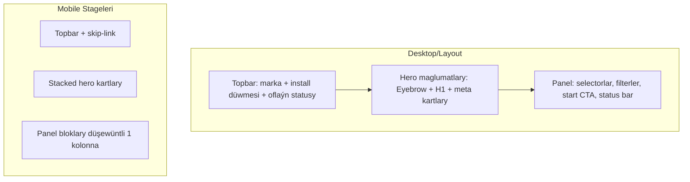

# UX we Arhitektura meýilnamasy

Bu resminama häzirki sahypanyň maketini, akymyny we interaktiwligini bir ýere jemläp, PWA oflaýn binýadyny hem düşündirýär. Şeýle hem geljekdäki inkirimental üýtgeşmeler üçin test we ýerleşdiriş meýilnamasy berilýär.

## Arhitektura gysgaça
- **App shell**: `index.html` + `style.css` UI-nyň esasy bölegi; `question-bank.js` we `script.js` sorag akymyny işleýär.
- **PWA gatlagy**: `pwa.js` registrasiýa, `service-worker.js` keşlenýän faýllar, `offline.html` oflaýn alternatiwasy, `manifest.webmanifest` metama info.
- **Sorag maglumatlary**: `question-bank.json` data çeşmesi; `question-bank.js` diňe okap beriji we gözleg/filter logikasy.
- **Netije maglumatlary**: `localStorage` arkaly ýokary bal sanawy (`highscore.js` / `highscore.html`).
- **Platforma integrasiýasy**: `distribution-config.js` arkaly platforma kartlary (APK, App Store, MSIX).

## Sahypa akymy — interaktiwlik we oflaýn logikasy
```mermaid
flowchart TD
  A[Ulanyjy sahypany açýar] --> B{Service worker barlaýar}
  B -->|Birinjisi| C[SW registrasiýasy we keş dolduryş]
  B -->|Täze wersiýa| D[Keşi täzeläň]
  C --> E[Question-bank fetch / filter]
  D --> E
  E --> F{Toplum saýlandy?}
  F -->|Ýok| G[Baş ekrandaky meta kartlary "Saýlanmady"]
  F -->|Hawa| H[Wagt/jerime konfigurasiýasy we Start aktiw]
  H --> I["Synaga başla"]
  I --> J[Timer + progress bar işjeň]
  J --> K[Jogap saýla]
  K --> L{Sorag gutardymy?}
  L -->|Hawa| M[Netije sahypasy + lokal saklama]
  L -->|Ýok| J
  M --> N[Ýalňyş jogaplary görkezmek / paýlaşmak]
  C --> O["Oflýn faýllary taýýarla" düwmesi → pre-cache]
```

## Wireframe taslamalary


## Maket we dizaýn aýratynlyklary
- **Grid/Flex**: Hero bölüminde iki kolonna (desktop), kiçi ekranda bir kolonna; selector we filterler `auto-fit` grid.
- **Status komponentleri**: `progress-bar` + `pill` statuslary aria-lary bilen; `feedback` bloki `aria-live` arkaly habar berýär.
- **Oflaýn arhitekturasy**: Service worker keşlenmesi, `offline.html` fallback, `data-prime-offline` düwmesi arkaly öňünden ýükleme.
- **Reýting/Netije**: `localStorage`-da ýokary ballar, paýlaşylýan gözden geçirmek tablisasy.

## Frontend stek saýlawy
- **Saýlanan stek**: **React + Vite** (ESM, code-splitting, SW/manifest integrasiýasy üçin `vite-plugin-pwa`).
- **Sebäp**: UI komponentleriniň gaýtadan ulanylmagy üçin JSX, Vite-niň çalt ösüş serweri we prefetch/treeshaking mümkinçilikleri, jest/rtl ýa-da Vitest bilen test etmegiň ýeňilligi.
- **Migrasiýa ýol kartasy**:
  1. Häzirki statiki UI-ni komponentler boýunça dilimläp, Vite `index.html`-i basgançaklaýyn götermek.
  2. PWA plugin-i bilen `manifest`/`service-worker` generasiýasyna geçmek.
  3. `question-bank`/`distribution-config` üçin `fetch`-leri `async data hooks` görnüşine geçirmek; localStorage görnüşlerini React state bilen ekişdirmek.

## Accessibility we UX aýratynlyklary
- Fokus görünýär, skip-link girizilýär; aria attributlary progress we status komponentlerinde.
- `prefers-reduced-motion` goldawy animasiýalary azaltmak üçin ulanýar.
- Form sahypalarynda degişli label, helper-text we aria-live bellikleri ulanylýar.

## Ulanyjy synagy we feedback sessiýalary
- **Prototip test**: Maýda partiýa bilen Figma/Storybook prototipleri, 5–7 ulanyjy, işleri: toplum saýlamak, offline ýüklemek, netije paýlaşmak.
- **Beta test**: PWA görnüşiniň TestFlight/MS AppCenter/Android internal testing kanallary arkaly paýlaşylmagy.
- **Ölçegler**: Netije ukyby (ýa-da ýalňyş derejesi), gurma/keş üstünlik derejesi, wagta görä completion.
- **Feedback kanallary**: In-app soragnama (modal), GitHub Issues, analitikada pageview + event loglary.

## Performance optimizasiýasy
- Code-splitting we lazy-loading: sorag banky we ýokary bal sahypasy aýratyn bünde goýberilýär.
- Minimal JS/CSS: umumy stil tokenleri we komponentler gaýtadan ulanylýar; assetler (ikonlar/SVG) inline edilýär.
- Surat optimizasiýasy: WebP/SVG, `loading="lazy"`, `prefetch/preload` başlanşyk aktiw elementler üçin.
- Monitoring: Lighthouse CI ýa-da PageSpeed budratyn, Sentry Performance/span loglary.

## Deployment pipeline meýilnamasy
1. **Version control**: Git branch/PR akymy, mandatory lint/test.
2. **CI/CD**: Build (Vite), unit/integration test, Lighthouse, PWA audit.
3. **Bundle barlagy**: `source-map-explorer` bilen bünde ululyklary gözegçilikde saklamak.
4. **Release**: GitHub Actions → statiki host (Netlify/Vercel) ýa-da S3 + CloudFront; SW/manifest cache-busting.
5. **Monitoring & analytics**: Plausible/GA4 eventleri, LogRocket/Sentry üçin ýalňyş gözegçiligi.

## Gradual rollout we iterasiýa
- Modul-modul çykarmak: täze komponentleri flag arkaly açyp, köne statik UI bilen paralel.
- Kullaniji feedback → düzediş → täze modul: her relizden soň ýalňyşlary yzarlamak üçin beta kanalyny saklamak.
- Oflýn cache wersiýa belgiligi goýup, täzelenmelerde "cache bust" etmek; ulanyjylara täzelenme bildiriji bildiriş görkezmek.
